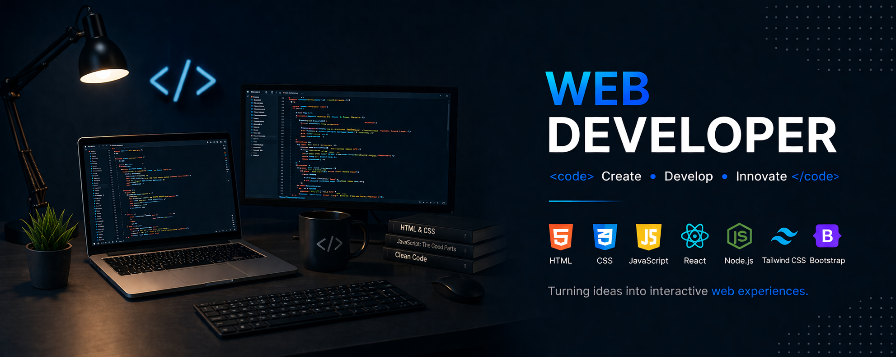

<!-- Bannière -->
<!-- Bannière -->

  

<h1 align="center">Salut 👋 Moi c'est Jawad </h1>

  

  
  

---

## 👨‍💻 À propos de moi

<h3>En plein apprentissage du développement web, je me consacre à la création de sites internet modernes à travers mes projets d'études. Mon objectif est de maîtriser le Front-End et le Back-End pour concevoir des sites complets et devenir développeur Full
</h3> Stack.

- 🎓 **Éducation :** Étudiant développeur web chez **La Plateforme**.
- 💻 **Spécialité :** Développement **Front-End** et **Back-End**.
- ⚛️ **Stack actuelle :** **React**, **JavaScript**, **PHP**.
- 🌱 **En cours :** Apprentissage des technologies modernes pour devenir développeur **Full Stack**.

---

## 🚀 Technologies & Outils

---

## 🏆 GitHub Trophies

  

---

## 📊 GitHub Stats

 

  
  
  

---

## 🐍 Contributions (Snake Animation)

  <picture>
    <source media="(prefers-color-scheme: dark)" srcset="https://raw.githubusercontent.com/jawad-zafari/jawad-zafari/output/github-contribution-grid-snake-dark.svg?v=3">
    <source media="(prefers-color-scheme: light)" srcset="https://raw.githubusercontent.com/jawad-zafari/jawad-zafari/output/github-contribution-grid-snake.svg?v=3">
    
  </picture>

---

✨ Merci de visiter mon profil GitHub ✨

